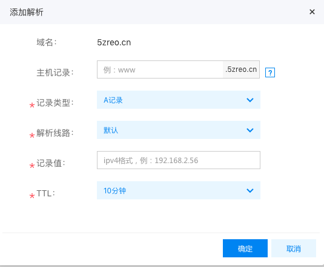
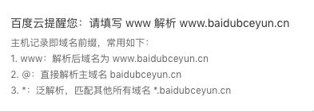

###1.服务器的选型
```
	我选用的是京东云的云主机liunx系统，因为赶上了京东云的618服务比较便宜（入门级)
```
###2 域名
```
	域名早先购买于百度云。
```
###3域名解析

	
[泛解析说明](https://baike.baidu.com/item/%E6%B3%9B%E5%9F%9F%E5%90%8D%E8%A7%A3%E6%9E%90/9845966?fr=aladdin&fromid=5787239&fromtitle=%E6%B3%9B%E8%A7%A3%E6%9E%90)

###4云服务搭建入门级别网站
[传送门](https://www.jdcloud.com/help/detail/572/isCatalog/1)
####5 技术选型
```
	node express起web服务 
	nginx通过监听80端口代理转发到相应的ip
```


